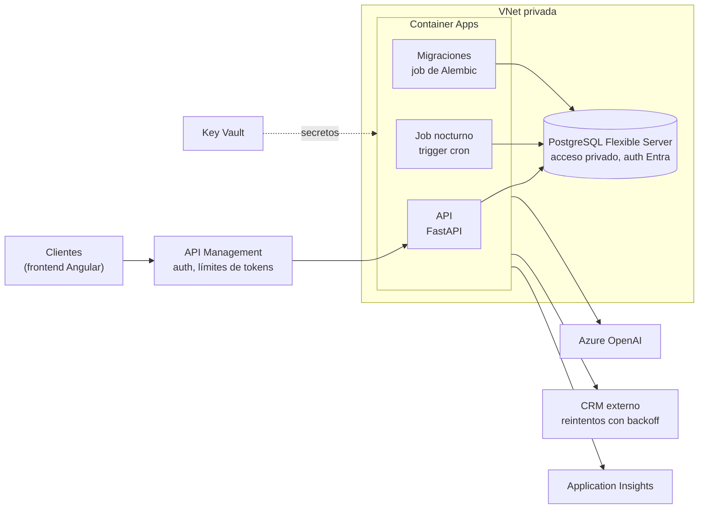
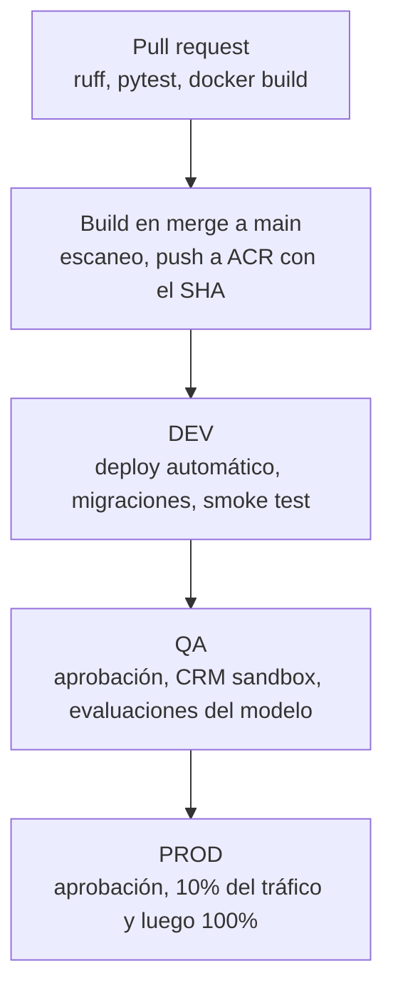

# Arquitectura en Azure

PUNTO IMPORTANTE
No tengo experiencia en AZURE, esta es una propuesta muy superficial usando Claude Fable y haciendo cross-checking en internet.

### La guia ARQUITECTURA_AWS es la que mas refleja mi posicion dados mis conocimientos actuales en AWS.

Cómo desplegaría este servicio en Azure. Nada de esto está implementado en el repositorio; es la propuesta.

## Vista general

## Despliegue y job nocturno

- La imagen del `Dockerfile` se publica en Azure Container Registry y la Container App la descarga con su identidad administrada.
- Ingress en el puerto 8000, interno detrás de API Management (hoy la API no tiene autenticación).
- Escalado por concurrencia HTTP con al menos una réplica.
- Agregaría un endpoint `/health` para los probes y movería la creación de tablas a migraciones con Alembic, ejecutadas como job antes de cada versión.
- El reanálisis nocturno es un **Container Apps Job con trigger cron** que usa la misma imagen con otro comando.
- "Pendiente" hoy sería `prioridad = 'alta' AND cliente_info IS NULL` (el CRM falló tras los reintentos). Si se necesita algo más amplio, agregaría una columna de estado y un contador de intentos.
- El job no vuelve a clasificar: solo consulta el CRM y regenera la respuesta. El upsert por `id` hace que reprocesar sea seguro.

## Secretos

- Key Vault por ambiente, leído con la identidad administrada de la app.
- Los secretos llegan como variables de entorno mediante referencias a Key Vault; `app/config.py` ya las lee así, sin cambios de código.
- Donde se pueda, sin secretos: PostgreSQL y Azure OpenAI con autenticación de Microsoft Entra.

## CI/CD en Azure DevOps

- La imagen se construye una sola vez y se promueve entre ambientes.
- CI no necesita secretos: las pruebas corren sin clave, sin CRM y sin `.env`.
- En QA corre un set de evaluación del modelo (exactitud de categoría y prioridad, datos inventados, inyección de prompt).
- El rollback en PROD es devolver el tráfico a la revisión anterior.
- Infraestructura en Bicep y conexión a Azure con workload identity federation.

## PostgreSQL sin acceso público

- Flexible Server con acceso privado (integración con VNet o private endpoint) y una zona DNS privada enlazada a la VNet.
- El Container Apps environment vive en la misma VNet; solo su subred llega al puerto 5432.
- TLS obligatorio (`sslmode=require`) y autenticación con la identidad administrada.
- Las migraciones corren como job dentro de la VNet, porque los agentes hospedados de DevOps no llegan a una base privada.
- Acceso de personas solo por Bastion o VPN.

## Monitoreo y costo del modelo

Monitorearía con Application Insights (OpenTelemetry):

- API: tráfico, latencia, errores y en especial la tasa de 502 (salida del modelo inválida).
- CRM: reintentos, tasa de `CRMUnavailable` y latencia.
- Modelo: latencia por nodo, tokens y distribución de categorías y prioridades.
- Logs estructurados sin el texto de la solicitud ni datos del CRM.

Para el costo, cada análisis ya guarda tokens y costo estimado, así que el gasto diario es una consulta SQL. Además:

- Usar el modelo más barato que pase las evaluaciones de QA (`OPENAI_MODEL`).
- Limitar tokens: texto máximo de 10.000 caracteres (ya validado) y `max_tokens` en la respuesta.
- No reprocesar: devolver el análisis guardado si el texto no cambió.
- Batch API para el job nocturno.
- Cuotas por deployment, límites de tokens en API Management y presupuestos con alertas.
- Mantener `PRECIO_INPUT_POR_MILLON` y `PRECIO_OUTPUT_POR_MILLON` alineados con los precios reales.
