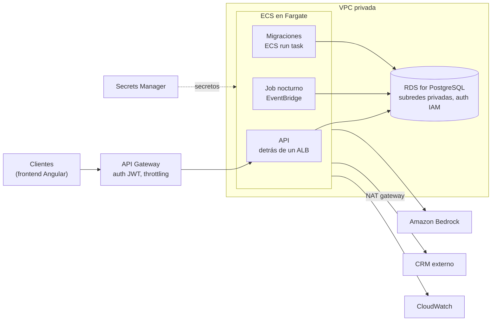

# Arquitectura en AWS

La misma propuesta de `ARQUITECTURA.md`, pero en AWS dada mi inexperiencia en Azure. 

El código del servicio casi no cambia, lo que cambia son los servicios administrados alrededor.

## Despliegue y job nocturno

La imagen va a **ECR** y la API corre como un servicio de **ECS en Fargate** detrás de un ALB interno. Delante pondría **API Gateway** (conectado al ALB por VPC link) para la autenticación con JWT y el throttling por cliente, ya que hoy la API no tiene autenticación.

Antes de desplegar haría dos ajustes, igual que en Azure: un endpoint `/health` para el health check del ALB y migraciones con Alembic en vez de `create_all` al arrancar.

El reanálisis nocturno lo haría con **EventBridge Scheduler**, que lanza una tarea de ECS con la misma imagen y otro comando. Las solicitudes pendientes serían las de `prioridad = 'alta'` sin `cliente_info` (el CRM falló). El job no vuelve a clasificar y el upsert por `id` hace que reprocesar sea seguro.

## Secretos

- **Secrets Manager** para los secretos y **Parameter Store** para la configuración que no es secreta, como `CRM_URL`.
- La task definition de ECS los inyecta como variables de entorno, así que `app/config.py` no cambia.
- Cada tarea tiene su propio rol de IAM y solo puede leer sus secretos.
- Donde se pueda, sin secretos: **RDS con autenticación IAM** (un token temporal como contraseña) y **Bedrock**, que usa el rol de la tarea en vez de una API key.

## CI/CD

El flujo es el mismo que en Azure:

> Pull request → build en merge a `main` → **DEV** → **QA** → **PROD**

- Como el repositorio está en GitHub, usaría **GitHub Actions** (CodePipeline o Azure DevOps también sirven), entrando a AWS por **OIDC** con un rol de IAM, sin llaves guardadas.
- La imagen se construye una sola vez, se escanea y se promueve el mismo digest por todos los ambientes.
- Una cuenta de AWS por ambiente (DEV, QA, PROD) dentro de AWS Organizations.
- En DEV: deploy automático, migraciones como tarea de ECS dentro de la VPC y smoke test con `scripts/demo.py`.
- En QA: aprobación, pruebas contra un CRM de sandbox y evaluaciones del modelo.
- En PROD: aprobación y despliegue **blue/green** con 10 % del tráfico primero. Si una alarma de CloudWatch salta, hace rollback solo.
- Infraestructura con CDK o Terraform.

## PostgreSQL sin acceso público

- **RDS for PostgreSQL** en subredes privadas, sin acceso público.
- El security group solo acepta el puerto 5432 desde el security group de las tareas de ECS.
- TLS obligatorio y autenticación IAM. **RDS Proxy** para manejar el pool de conexiones entre tareas.
- La salida al CRM pasa por un **NAT gateway**; para ECR, Secrets Manager, CloudWatch y Bedrock usaría **VPC endpoints** (más privado y más barato que pasar todo por el NAT).
- Las personas entran con **SSM Session Manager** (port forwarding), sin bastion ni puertos abiertos.

## Monitoreo y costo del modelo

Monitoreo con **CloudWatch** (logs, métricas, alarmas y Container Insights) y trazas con OpenTelemetry hacia **X-Ray**. Lo que miraría es lo mismo que en Azure:

| Qué | Por qué |
|---|---|
| Tasa de 502 | La salida del modelo no validó |
| Reintentos y `CRMUnavailable` | Salud del CRM y análisis sin datos del cliente |
| Latencia por nodo del grafo | Dónde se va el tiempo |
| Distribución de categorías y prioridades | Un salto raro indica un problema con el prompt |
| Tokens por modelo (métricas de Bedrock) | Base para el costo |

Para el costo:

- Cada análisis ya guarda tokens y costo, así que el gasto diario sale de una consulta.
- **AWS Budgets** y **Cost Anomaly Detection**, con tags por ambiente.
- Un **application inference profile** de Bedrock por aplicación o ambiente para ver el gasto del modelo por separado.
- **Batch inference** de Bedrock para el job nocturno (cerca de la mitad del precio).
- `max_tokens` en la respuesta, usage plans en API Gateway y el modelo más barato que pase las evaluaciones.
- Mantener `PRECIO_INPUT_POR_MILLON` y `PRECIO_OUTPUT_POR_MILLON` con los precios de Bedrock.

## Cambios en el código

Son pocos:

1. `get_llm()` en `app/llm.py` devolvería `ChatBedrockConverse` (paquete `langchain-aws`). Bedrock soporta salida estructurada y reporta uso de tokens, así que `invoke_structured()` y el conteo de tokens siguen funcionando igual. Si prefiero seguir con OpenAI, la clave va a Secrets Manager y el tráfico sale por el NAT.
2. `app/db.py` agregaría el token de IAM para conectarse a RDS.
